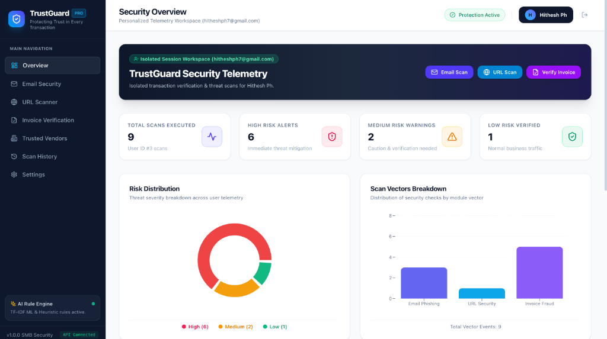
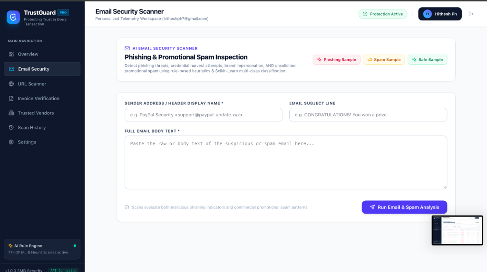
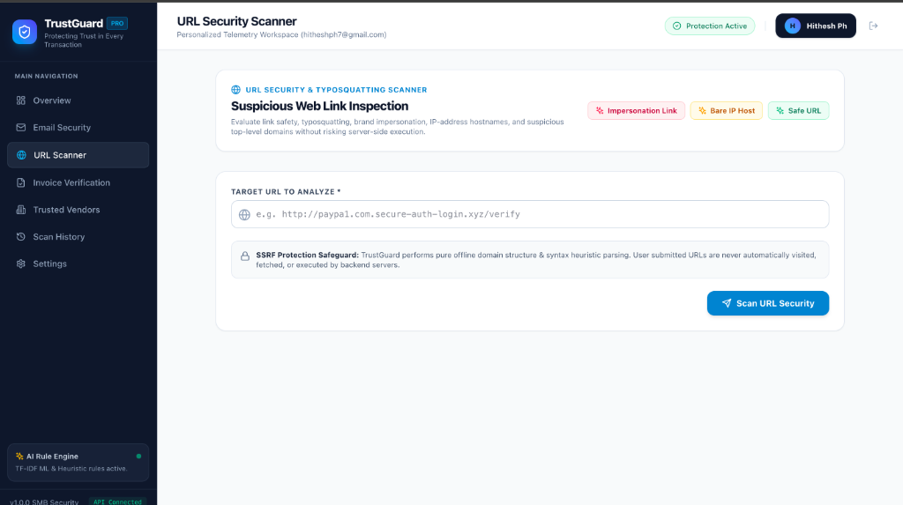
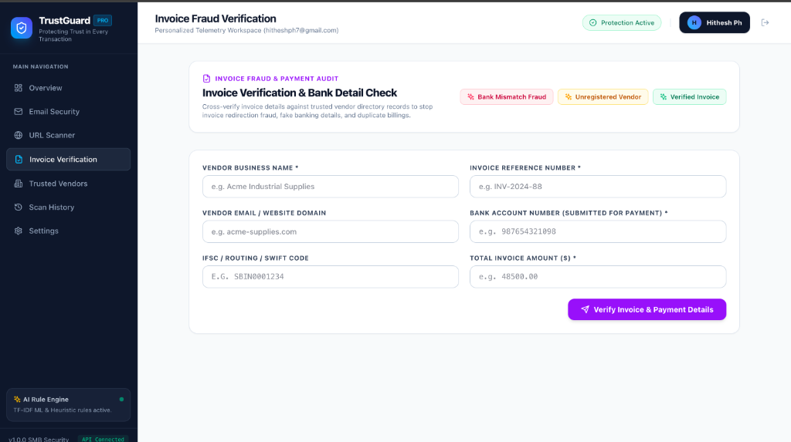
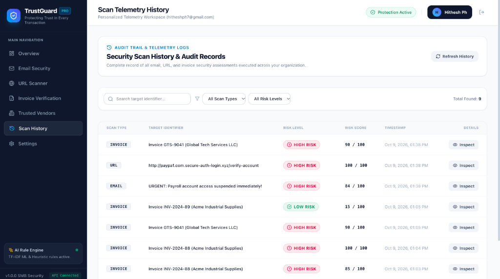

# TrustGuard — AI-Powered Business Security Platform

**OPCODE IMPACT 2026 | Hackathon Submission**

**Team ID:** OPCO11(4)

---

## 1. Problem Statement
Small and medium-sized businesses (SMBs) are increasingly targeted by sophisticated cyber threats, including email phishing, typosquatting domain impersonation, and invoice redirection fraud. Most enterprise security solutions are complex, expensive, and require dedicated security teams. SMBs urgently need an intuitive, accessible, and automated security platform that detects phishing attacks, malicious web links, and invoice payment tampering before credentials are lost or wire transfers executed.

---

## 2. Solution Title
**TrustGuard — AI-Powered Business Security Platform**

---

## 3. Solution Description
TrustGuard is a complete, runnable, modular web application designed to protect small and medium businesses against email phishing, promotional spam, suspicious URLs, and invoice fraud. It combines rule-based heuristic security engines with a Scikit-Learn multi-class Machine Learning classifier (TF-IDF + Naive Bayes) to detect urgency, credential harvesting, display name spoofing, and unsolicited spam. Additionally, TrustGuard provides a static structural URL scanner with SSRF protection safeguards and an auditable Trusted Vendor directory cross-verification engine that detects bank account, IFSC/routing, domain, and invoice reference mismatches before payment authorization.

---

## 4. Architecture Diagram
```
                          ┌────────────────────────────────────────┐
                          │            React + Vite UI             │
                          │   (Tailwind CSS, Recharts, Lucide)     │
                          └──────────────────┬─────────────────────┘
                                             │ REST API (JSON)
                                             ▼
                          ┌────────────────────────────────────────┐
                          │         FastAPI Backend Engine         │
                          │   (Pydantic Validation, CORS, Auth)    │
                          └────┬─────────────────┬─────────────┬───┘
                               │                 │             │
                               ▼                 ▼             ▼
                     ┌─────────────────┐ ┌──────────────┐ ┌───────────────┐
                     │ Email & Spam    │ │ URL Security │ │ Invoice Fraud │
                     │ Detector Engine │ │ Scanner      │ │ Verification  │
                     │ (TF-IDF + NB ML)│ │ (Lookalikes) │ │ Engine        │
                     └────────┬────────┘ └──────┬───────┘ └──────┬────────┘
                              │                 │                │
                              └─────────────────┼────────────────┘
                                                │
                                                ▼
                                   ┌─────────────────────────┐
                                   │ SQLite DB (SQLAlchemy)  │
                                   │ (Scans, Vendors, Users) │
                                   └─────────────────────────┘
```

**Workflow Explanation:**  
The React frontend communicates with the FastAPI REST API server. When a user submits an email, URL, or invoice for analysis, the backend invokes dedicated security detection microservices. The email engine runs rule-based heuristics alongside a Scikit-Learn multiclass TF-IDF model. The URL engine parses hostname structures, IP hosts, and typosquatting brand patterns without fetching external links (SSRF protection). The invoice engine cross-references submitted payment details against the Trusted Vendor SQLite database. All telemetry events are persisted and rendered on the user's isolated dashboard.

---

## 5. Technology Stack
- **Frontend:** React.js, Vite, JavaScript, Tailwind CSS, React Router, Recharts, Lucide React, Fetch API
- **Backend:** Python 3.14, FastAPI, Pydantic v2, SQLAlchemy ORM, Scikit-learn (TF-IDF Vectorizer, Multinomial Naive Bayes)
- **Database:** SQLite (SQLAlchemy ORM)
- **Other Technologies:** Pytest (Backend Test Suite), Uvicorn ASGI Server, CORS Middleware, Custom Bearer Session Auth

---

## 6. Quick Start Guide
**Prerequisites:** Python 3.10+ and Node.js 18+ with npm.

**Installation & Execution:**
```bash
# 1. Clone or navigate to the project directory
cd /Users/hithesh/Documents/TrustGuard

# 2. Setup and launch Backend (Terminal 1)
cd backend
python3 -m venv venv
source venv/bin/activate
pip install -r requirements.txt
pytest   # Run automated test suite
uvicorn app.main:app --host 0.0.0.0 --port 8000 --reload

# 3. Setup and launch Frontend (Terminal 2)
cd ../frontend
npm install
npm run dev
```

Access the frontend at `http://localhost:5173` and backend API docs at `http://localhost:8000/docs`.

---

## 7. Output Screenshots

### 1. Security Telemetry Overview Dashboard

*Real-time security telemetry displaying total scans executed, risk distribution (donut chart), scan vectors breakdown (bar chart), session isolation badges, and quick-action scan launchers.*

### 2. Email Phishing & Spam Inspector

*Evaluates email header details, display names, and body content using Scikit-Learn TF-IDF machine learning and heuristic rules to detect phishing threats and promotional spam.*

### 3. URL Security & Typosquatting Scanner

*Evaluates link safety, typosquatting brand impersonation, raw IP hosts, and high-risk TLDs without external network fetches (offline SSRF-safe parsing).*

### 4. Invoice Fraud & Bank Detail Verification

*Cross-verifies submitted vendor details, invoice reference numbers, bank account numbers, and IFSC/routing codes against trusted vendor directory records to stop redirection fraud.*

### 5. Security Scan History & Audit Records

*Complete audit trail recording all user-isolated email, URL, and invoice security assessments with filterable search and deep-dive modal inspection.*

---

## 8. Future Scope
- **Automated SIEM & Webhook Integrations**: Push high-risk security alerts directly to Slack, Microsoft Teams, or enterprise SIEM platforms (Splunk/Elastic).
- **Automated OCR Invoice Scanner**: Extract invoice fields directly from PDF and image uploads using Tesseract OCR or Vision LLMs.
- **Hardware Passkey Integration**: Native browser WebAuthn API support for hardware security key logins (YubiKey/TouchID).

---

## 9. Team Contributions
| Member Name | Contribution |
|-------------|--------------|
| Hithesh , Agnal| End-to-end full-stack architecture, FastAPI backend design, security detection heuristics & Scikit-Learn ML classifier model |
| Evisha , Richa| React frontend UI design, Tailwind CSS styling system, Recharts telemetry charts, and API integration |
| Hithesh , Agnal | Database modeling (SQLAlchemy), SQLite seed script, Pytest test suite, and documentation |


## 10. Tools Used
| Tool / Platform | Purpose / Why Used |
|-----------------|--------------------|
| FastAPI & Python | High-performance asynchronous REST API framework for fast execution and easy ML model integration |
| React & Vite | Modern, high-efficiency frontend framework for building dynamic enterprise dashboards |
| Scikit-learn | Lightweight, explainable machine-learning classification (TF-IDF + Naive Bayes) |
| Antigravity AI Assistant | AI Pair Programmer used for rapid monorepo scaffolding, test writing, UI styling, and debugging |
